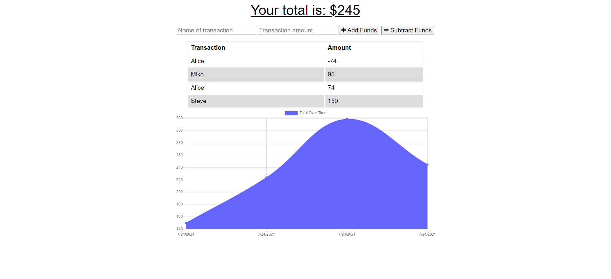
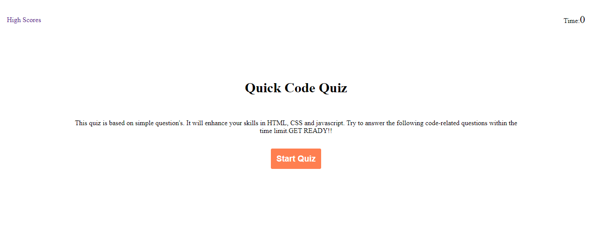
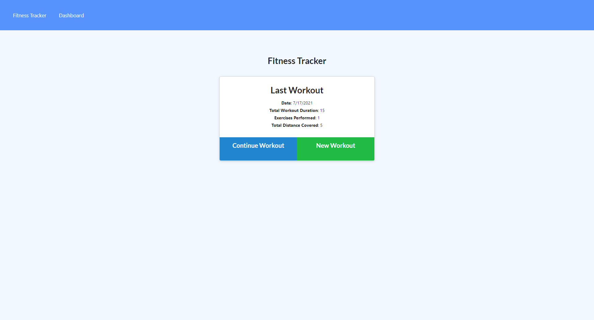
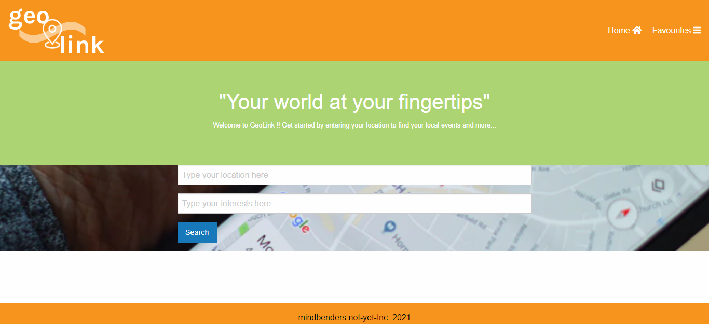
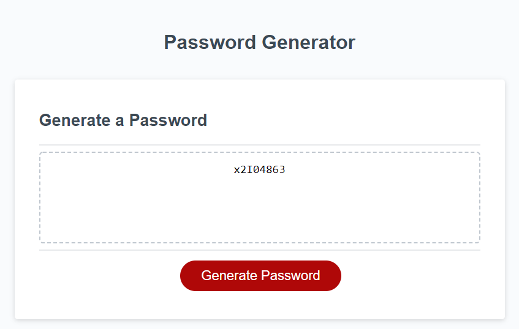
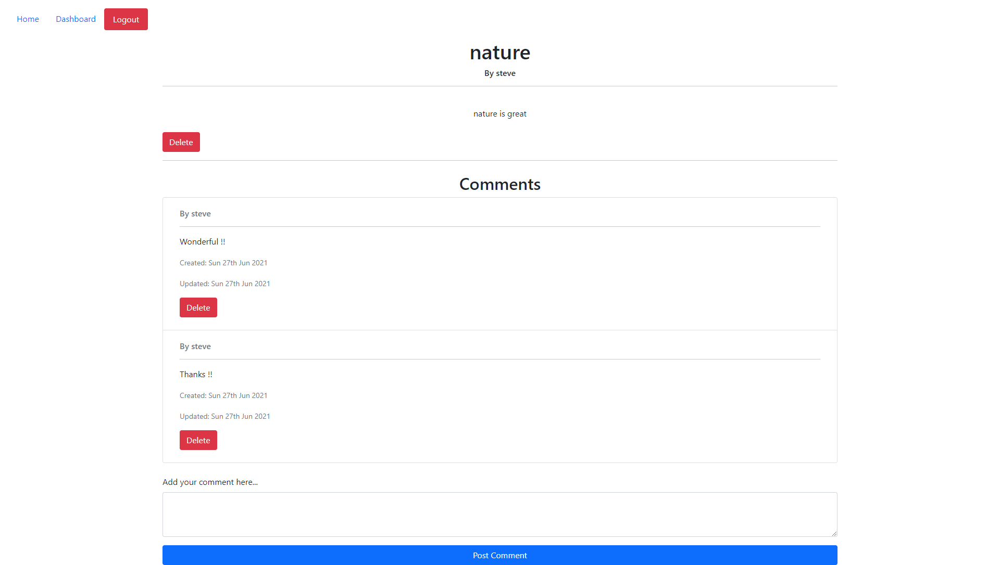
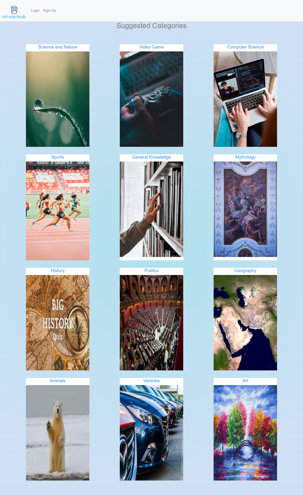
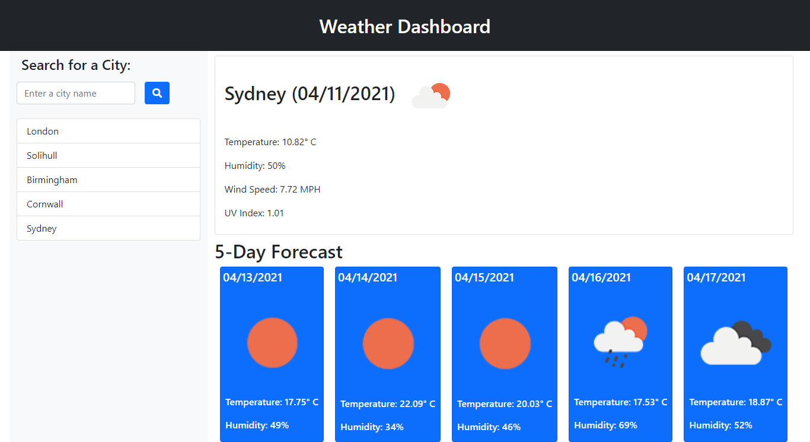

# React Portfolio

React portfolio is an application made in react. It will display the projects completed by me.
This is an easy and fast way to build a project.

## Description

In react portfolio

- Navbar/ Header - First thing which was introduces is the navbar which contains the link to home, about me and contact.
- ABout - This section contains a picture of mine and the description about my life in short.
- Projects - After that, there are slides which goes on and it contains various projects completed by me with the deployed links.
- Contact details: This sections contains my linkedIn, github, email and resume link. They are accessible on single click.
- Footer: It has a copyright section in it.

Various projects added on are:

## Github Link

https://github.com/Etipriya/react-portfolio-eti

## Deployed Link

https://etipriya.github.io/react-portfolio-eti/
